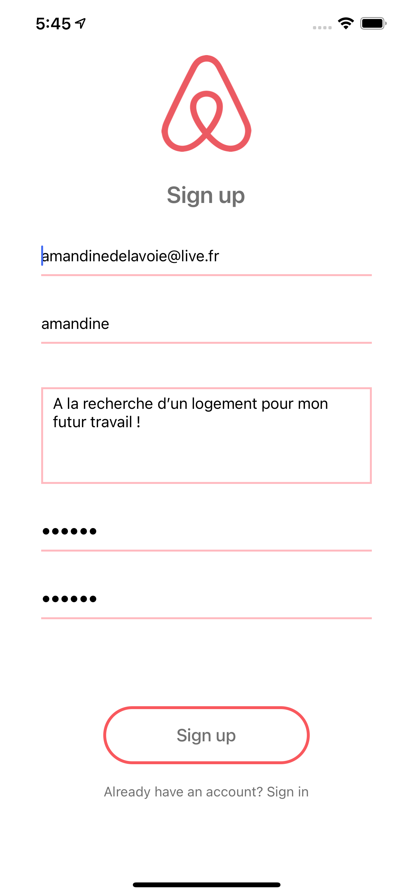
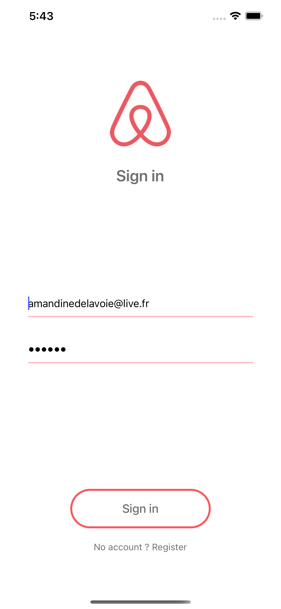
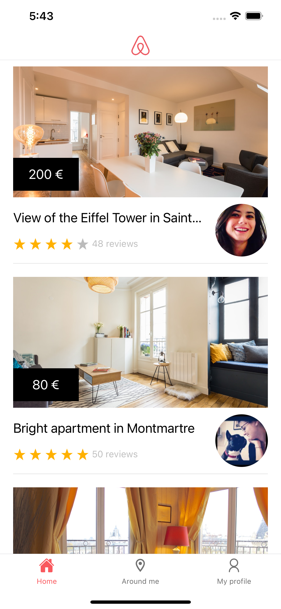
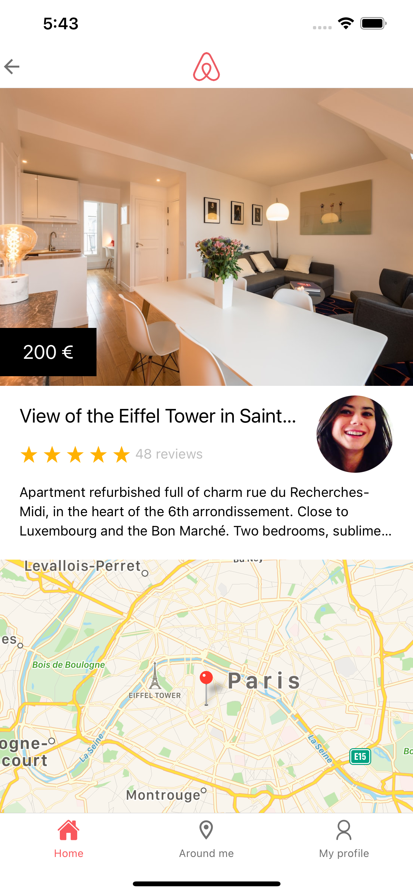
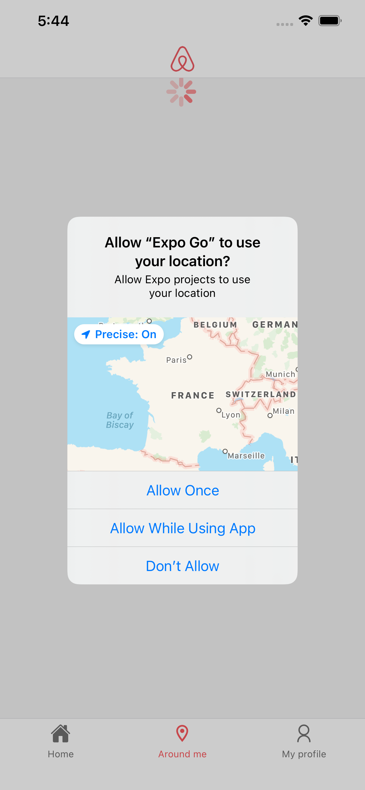
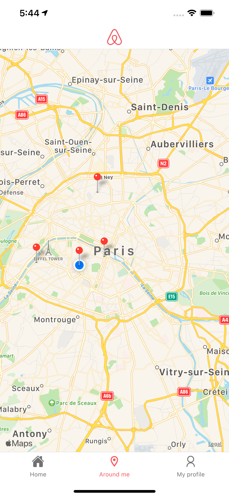
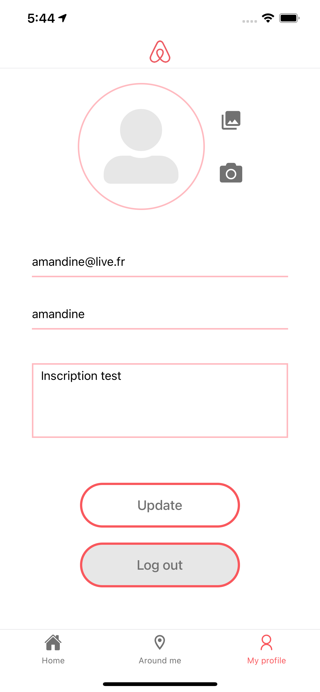
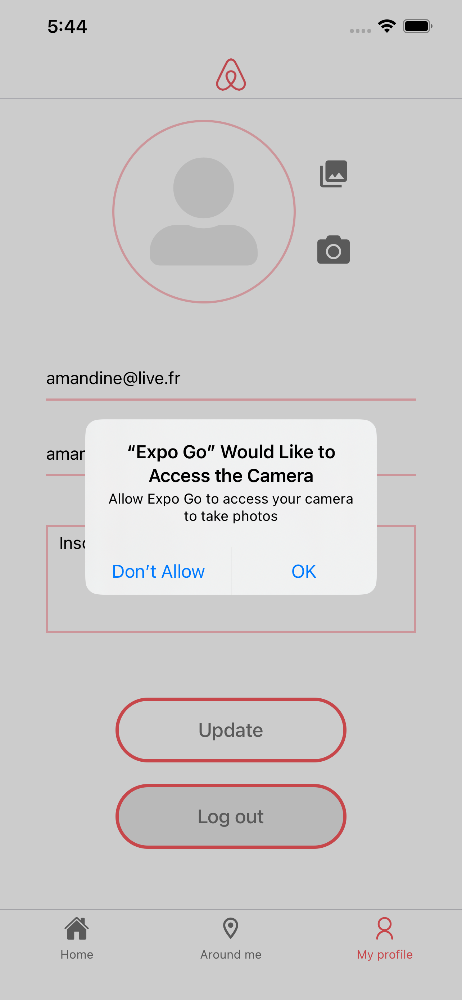

<h1 align="center">
	Airbnb Clone - React Native
</h1>

	
	

## Features

- Create / modify / delete profile
- Login / logout
- Navigation between ads
- See ads around me

## Screenshots

<h3>Login / SignUp</h3>

		 
		<h3>Home / Room </h3>

		 
		<h3>Around Me</h3>

 
		<h3>My Profil</h3>

## Packages

- [React Navigation v5](https://reactnavigation.org/)
- [Expo ActionSheet](https://github.com/expo/react-native-action-sheet)
- [KeyboardAwareScrollView](https://github.com/APSL/react-native-keyboard-aware-scroll-view)
- [React Native Snap Carousel](https://github.com/archriss/react-native-snap-carousel)
- [React Native Maps](https://github.com/react-native-community/react-native-maps)
- [Axios](https://github.com/axios/axios)
- Async Storage
